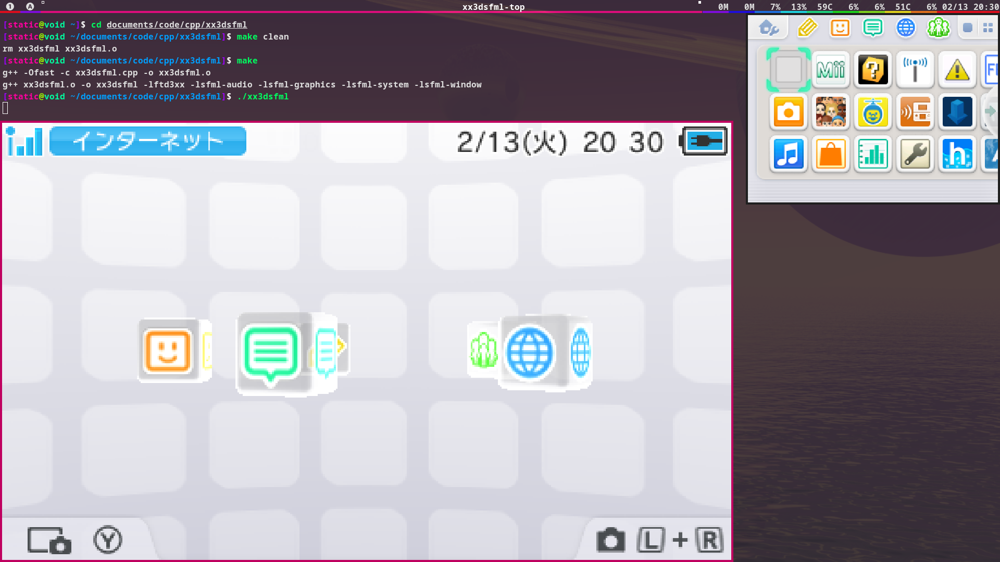
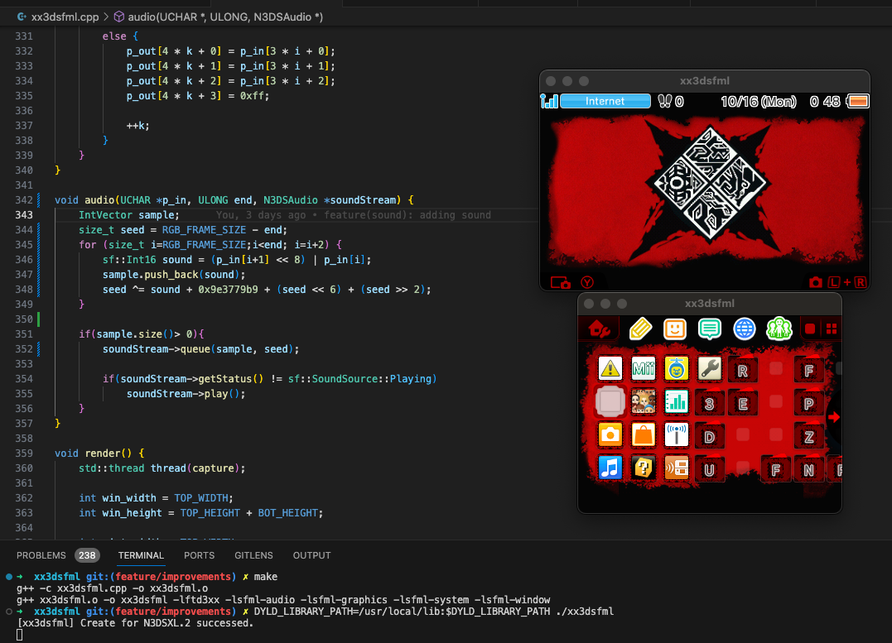

# **xx3dsfml**

xx3dsfml is a multi-platform capture program for [3dscapture's](https://3dscapture.com/) N3DSXL capture card written in C/C++.

#### Dependencies

*Note: The following instructions are for Linux.*

xx3dsfml has two dependencies, [FTDI's D3XX driver](https://ftdichip.com/drivers/d3xx-drivers/) and [SFML](https://www.sfml-dev.org/).

The D3XX driver can be downloaded from the link above which also contains the installation instructions. However, in order to compile the xx3dsfml.cpp code, two additional steps need to be taken:

1. A directory named libftd3xx needs to be created in the /usr/include directory.
2. The ftd3xx.h and WinTypes.h header files need to be copied to the newly created libftd3xx directory.

Doing this is the equivalent of installing a development package for a utility via a package manager and will allow **any** C/C++ code/compilers to reference these headers.

The SFML **development** package for **C++** also needs to be installed. C++ is the default language for SFML and is not a binding. This can very likely be installed via your package manager of choice.

#### Install

Installing xx3dsfml is as simple as compiling the xx3dsfml.cpp code. A Makefile utilizing the Make utility and g++ compiler is provided with the following functionality:

1. make:	This will create the executable which can be executed via the ./xx3dsfml command.
2. make clean:	This will remove all files (including the executable) created by the above command.

#### Window modes

Currently support single window and split window to change this startup behavior just change the code before make
#define WINDOWS 1 // for single view
#define WINDOWS 2 // for split view

#### Controls

*Note: All of the following numeric controls are accomplished via the Number Row and not the Numeric Keypad.*

When the xx3dsfml program is executed, it will attempt to open a connected N3DSXL for capture once at start. However, an N3DSXL can be connected at any time while the software is running but will require it to be manually opened using the 1 key in this case. Pressing the 1 key at any time while an N3DSXL is open will close it and vice versa. If an open N3DSXL is disconnected at any time while the software is running, the device will automatically close and should be reopened via the 1 key when reconnected.

The following is a list of controls currently available in the xx3dsfml program:

- 0 key: Single view or Split views
- 1 key: Opens a connected N3DSXL if not yet open, otherwise closes a connected N3DSXL if open.
- 2 key: Toggles smoothing on/off. This is only noticeable at 2x scale or greater.
- 3 key: Decrements the scaling. 1x is the minimum and the default.
- 4 key: Increments the scaling. 4x is the maximum.
- 5 key: Rotates the window 90 degrees counterclockwise.
- 6 key: Rotates the window 90 degrees clockwise.

When you are in 2 window mode you should input Keys on top Screen

#### Notes

This software currently lacks audio support as I'm unable to get the capture card in a state where it'll output more than just the frame data. This is still a work in progress, but I'm unsure if I'll ever be able to figure out how to get the capture card to output any audio data. In the meantime, audio can be captured directly from the AUX port on the N3DSXL over a line level input as a workaround.

#### Media

